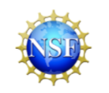

```{r setup, include=FALSE}
knitr::opts_chunk$set(echo = FALSE)
```


 

Statistics  is fundamentally about data; StatPREP is fundamentally about helping instructors teach with data. We work with college instructors who want to teach statistics with a modern pedagogy and with a direct emphasis on real data wrangling and visualization techniques.


<iframe width="560" height="315" src="https://www.youtube.com/embed/tqpR85GhOwo" frameborder="0" allow="accelerometer; autoplay; clipboard-write; encrypted-media; gyroscope; picture-in-picture" allowfullscreen></iframe>

**Favorite Links**

- [MAA Connect](https://connect.maa.org/home)
- [Little Apps](https://statprep.github.io/LittleAppSite)
- [Data Science in a Box](https://datasciencebox.org/) Mine Çetinkaya-Rundel
- [*Statistics using Technology* (3/e)](https://www.coconino.edu/open-source-textbooks#statistics-using-technology-3rd-edition-by-kathryn-kozak) by Kate Kozak
- [*Compact Guide to Classical Inference*](https://dtkaplan.github.io/CompactInference/) by Daniel Kaplan
- [Open Intro *Introduction to Modern Statistics*](https://www.openintro.org/book/ims/) by Mine Çetinkaya-Rundel and Johanna Hardin
- [*Modern Dive*](moderndive.com): *Statistical Inference via Data Science*, by Chester Ismay and Albert Y Kim


 

 

**StatPREP Regional Hubs** 

- [Los Angeles Area]() :: [Washington, DC Area]() :: [Seattle Area]() 
- [Fort Worth, TX Area]() :: [Fort Myers, FL Area]() [Minneapolis/St. Paul]()

 

 

**StatPREP is funded by the NSF (DUE-1626337)**


 

 


[edit this page](https://github.com/StatPREP/StatPREP.github.io/edit/main/index.Rmd)
